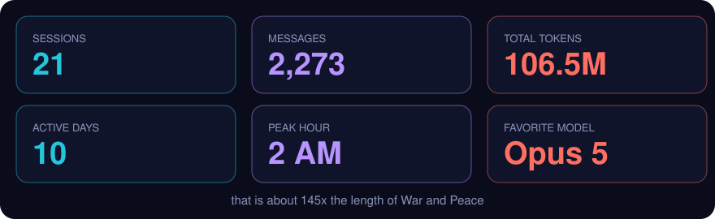
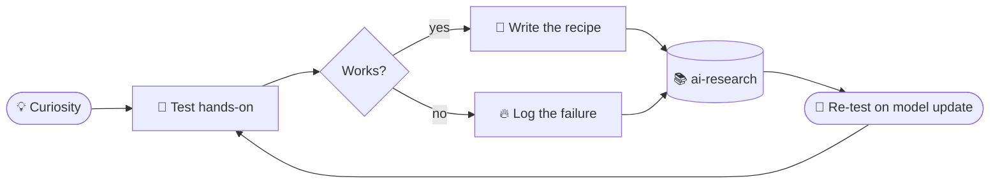

 

  

**[🕹️ Play the live site → zoronoazoro.dpdns.org](https://zoronoazoro.dpdns.org)**

---

## 🧪 What is this?

My open lab notebook: honest research notes on **AI tools, video generation, agents, and LLM workflows**. Try the tool, break the tool, write down what worked.

## 🕹️ Commit Invaders

> Want it playable? The [live site](https://zoronoazoro.dpdns.org) has the same board: move to fly, click to fire.

## 🔥 Token burn report

## 🧠 How a note is born

## 📚 Notes index

<b>🛠️ AI Tools</b>

- [ ] Tool comparison matrix
- [ ] Free vs paid: where the paywall matters
- [ ] My daily stack

<b>🎬 Video Generation</b>

- [ ] Prompt anatomy: subject, motion, camera, style
- [ ] Character consistency across shots
- [ ] Image-to-video vs text-to-video

<b>🤖 Agents</b>

- [ ] Architectures explained with diagrams
- [ ] MCP servers worth installing
- [ ] Failure log

<b>⚙️ LLM Workflows</b>

- [ ] Prompt chaining patterns
- [ ] Cheap evals
- [ ] Token budgeting

---

⭐ Star the repo · 🐛 Request a tool test · 🔀 Send your findings

3. Actions tab > "Contribution Games" > Run workflow (creates the `output` branch).
4. Contribution graphs belong to a USER account. If zoronoa-zoro is an organization,
   change github_user_name / USERNAME in the workflow to your personal username.
5. Put your screenshots in /assets and uncomment the Token burn images.
============================================================ -->
